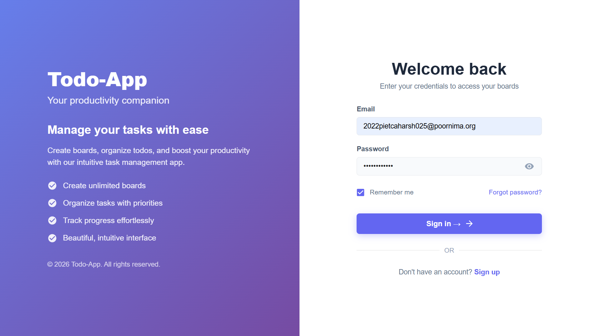
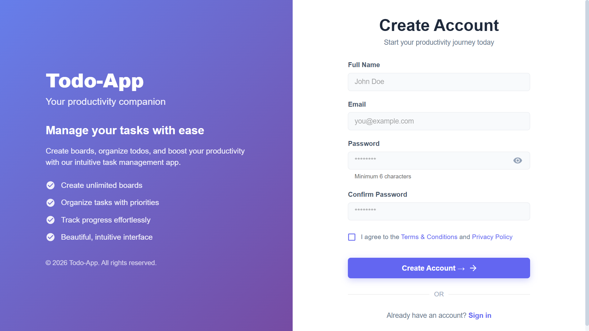
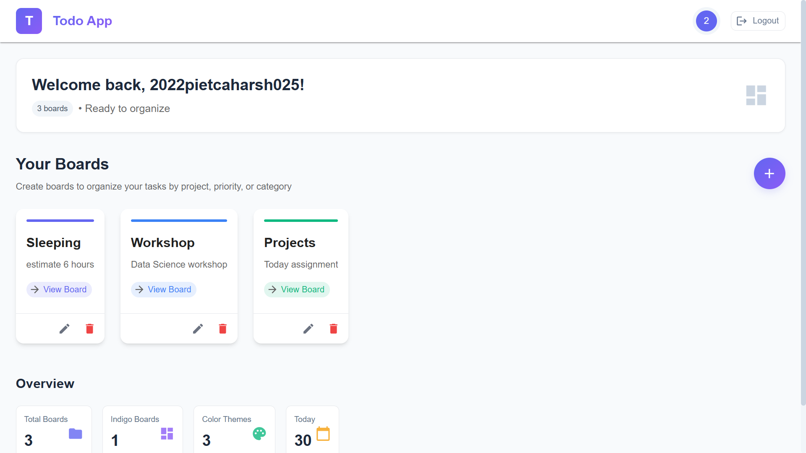
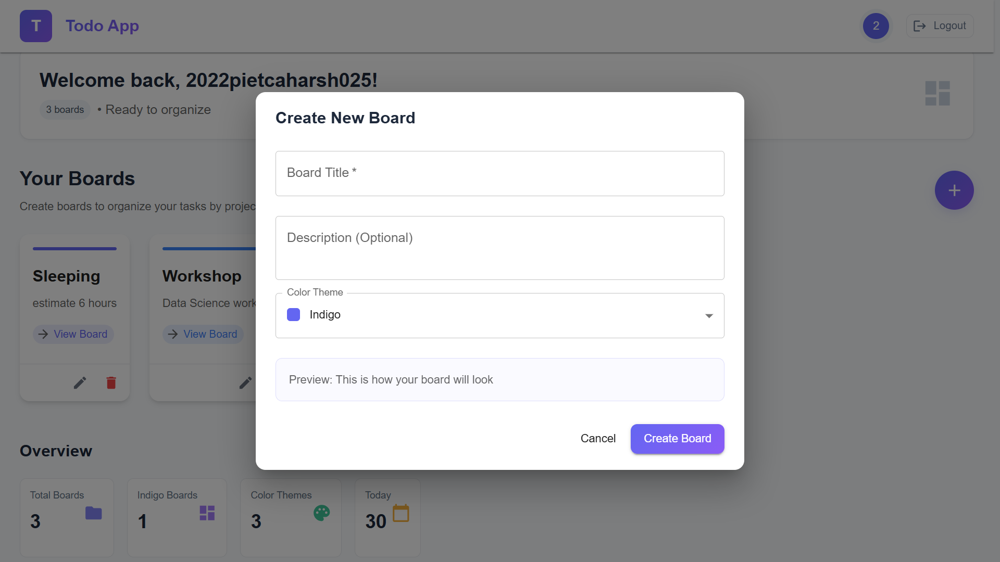
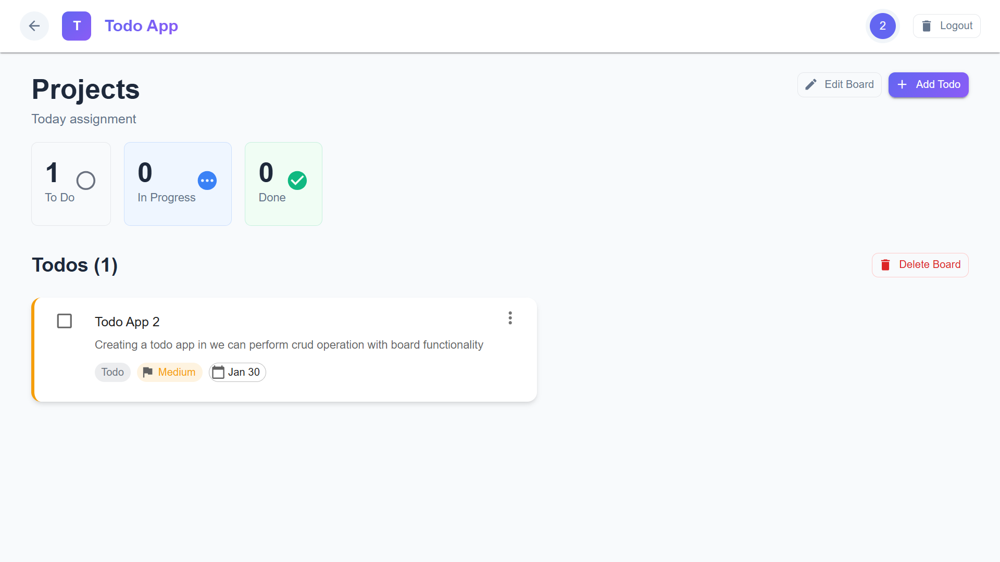
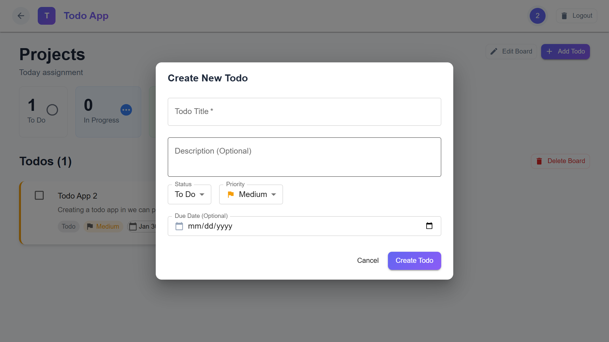

# 📝 ToDo Web App — Full Stack Assignment (Humanli.AI)

A beautifully designed **Board + Task Management Web App** built as per the Humanli.AI Technical Assignment.

Users can:

- Register & Login (Firebase Authentication)
- Create Boards
- Add, edit, complete, delete tasks inside boards
- Priority-based colored tasks (Low / Medium / High)
- Due Dates
- Progress Tracking
- Secure API using Firebase Admin Authentication
- Fully Modern UI (TaskFlow/BoardBuddy Inspired)

---

# 📸 UI Screenshots

The ToDo Web App includes a modern, beautiful UI inspired by TaskFlow/BoardBuddy.  
Below are the key screens of the application.

---

## 🔐 Authentication

### **Login Page**


### **Register Page**


---

## 🏠 Dashboard

### **Dashboard Overview**
Displays all user boards with clean modern cards.


### **Board Card (Preview)**


---

## 📁 Board View

### **Board Header (Purple Section)**
Shows board title, today’s description, and task progress.


---

## 📝 Tasks

### **Task List View**
Beautiful list UI with priority colors, due dates, and actions.


### **Todo Card (Task Item)**


---

# 🚀 Tech Stack

### **Frontend**
- React.js  
- Tailwind CSS  
- Firebase Authentication  
- Axios

### **Backend**
- Node.js + Express.js  
- MongoDB (local via MongoDB Compass)  
- Firebase Admin SDK  
- Mongoose  

---

# 📁 Project Folder Structure

```
todo-app/
  backend/
    src/
      config/db.js
      middleware/auth.js
      models/Board.js
      models/Todo.js
      routes/boardRoutes.js
      routes/todoRoutes.js
      controllers/
      app.js
      server.js
    firebase-admin.json
    .env
    package.json

  frontend/
    src/
      pages/
      components/
      context/AuthContext.jsx
      firebase.js
      api.js
      App.js
      index.js
      index.css
    tailwind.config.js
    package.json
```

---

# 🗄️ Backend Setup

```sh
cd backend
npm install
```

Create `.env`:

```
MONGO_URI=mongodb://127.0.0.1:27017/todoapp
PORT=5000
```

Start backend:

```sh
npm run dev
```

---

# 🎨 Frontend Setup

```sh
cd frontend
npm install
npm start
```

---

# 🎯 How to Run Full Project

Backend:

```sh
cd backend
npm run dev
```

Frontend:

```sh
cd frontend
npm start
```

---

# 📡 API Endpoints

### 📌 Boards
- GET `/api/boards`
- POST `/api/boards`
- PUT `/api/boards/:id`
- DELETE `/api/boards/:id`

### 📌 Todos
- GET `/api/todos/:boardId`
- POST `/api/todos`
- PUT `/api/todos/:id`
- PATCH `/api/todos/:id/toggle`
- DELETE `/api/todos/:id`

---

# 🤵 Author

**Harsh Kumar Agrawal**  
Full Stack Developer  
GitHub: https://github.com/agharsh53

---
